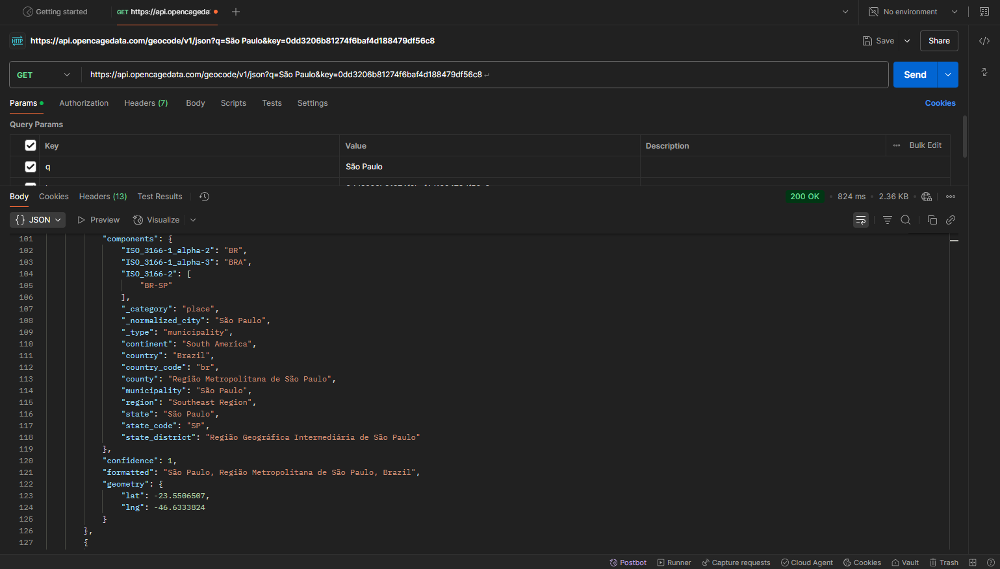

# Projeto Clima PHP

Projeto API CLIMA PHP, consulte dados climáticos da sua cidade!

## Screenshots

## Integrantes

- Jhonatas Micael Jacometto
- Vittor Patricio
- Maria Eduarda Migliaris

## Como Usar❓

    1. Clone este repositório em sua máquina local.
    2. Inicie o XAMP
    3. Entre no seu diretório local/(nome da pasta)
    4. Exemplo: http://localhost/clima

